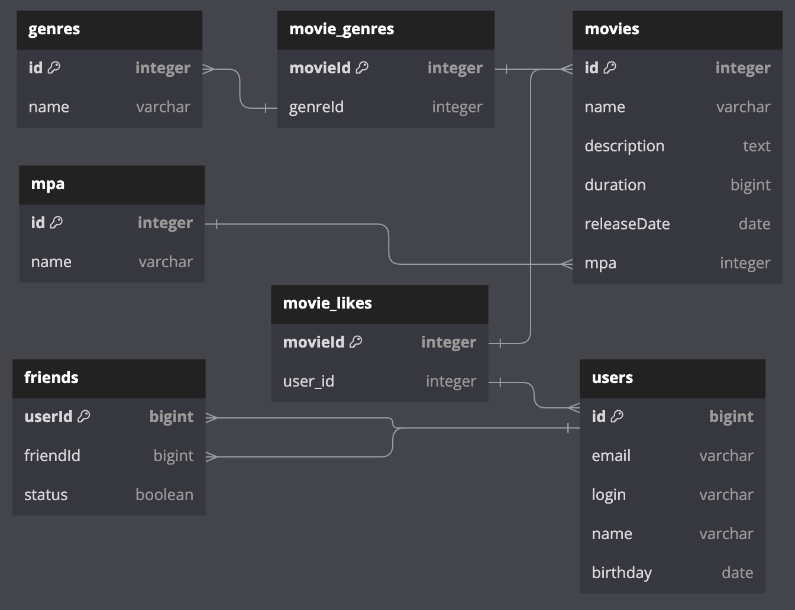

# 🍿MovieRater🍿

MovieRater is a backend for a social network application that helps users choose movies based on what they and their friends watch and the ratings they give.

## Technologies

- Spring Boot
- Maven
- REST API
- SLF4J (Simple Logging Facade for Java)
- SQL (H2 Database)

The application is developed using Spring Boot and built with Maven. It uses an H2 database to store essential entities such as users, movies, and genres.

> About H2 Database
> H2 is a lightweight, embedded SQL database written in Java. It is ideal for development and testing purposes, as it can be easily integrated into Java applications and provides an in-memory database option.

## REST API

The application provides a REST API for performing CRUD (Create, Read, Update, Delete) operations on entities such as users, movies, and genres. All API endpoints have been thoroughly tested using Postman.

## Database Entity Relationship Diagram (ERD)

